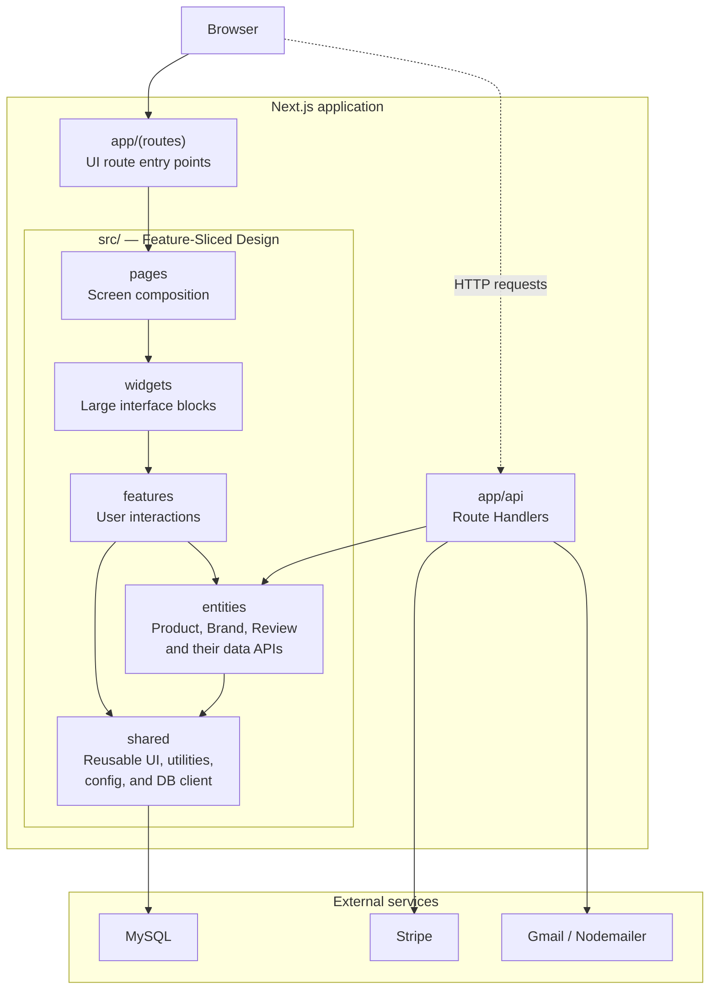

# PLAST-AVTO

> An auto-parts storefront with a catalogue, cart, reviews, and a demonstration payment flow.

[](#status) [](./LICENSE) [](https://nextjs.org/) [](https://react.dev/) [](https://www.typescriptlang.org/)

[](https://www.mysql.com/) [](https://stripe.com/) [](https://zustand.docs.pmnd.rs/) [](https://tailwindcss.com/)

<a id="contents"></a>

## Contents

- [About](#about)
- [Status](#status)
- [Features](#features)
- [Technology stack](#stack)
- [Quick start](#quick-start)
- [Environment variables](#environment)
- [Architecture](#architecture)
- [Routes and API](#routes)
- [Database](#database)
- [Commands](#commands)
- [Testing](#testing)
- [Technical limitations and debt](#limitations)
- [License](#license)

<a id="about"></a>

## About

**PLAST-AVTO** is a web application for an automotive wheel-arch liner store. It was created as a foundation for a commercial website: users can browse and filter the catalogue, open product pages, add items to the cart, leave reviews, and proceed to payment through Stripe Checkout.

The project was not launched as a production service and is now frozen. It is not a ready-to-use store for accepting real payments, but a codebase with a working domain model and interface that can serve as a demo, learning project, or starting point for further development.

The application interface and copy are in Ukrainian; the configured contact details are placeholders.

<a id="status"></a>

## Status

> **The project is on hold.** The latest work focused on a gradual migration from JavaScript/JSX to TypeScript/TSX: the `shared` layer, catalogue entities, reviews, cart, and selected UI components have been typed. The migration is incomplete, so JS/JSX and TS/TSX currently coexist in the repository.

At the time this README was updated, `src`, `app`, `pages`, and `tests` contain 96 JavaScript/JSX files and 62 TypeScript/TSX files. This mixed state is enabled by `allowJs` in [tsconfig.json](./tsconfig.json); TypeScript checking for existing JavaScript files is disabled with `checkJs: false`.

<a id="features"></a>

## Features

- Catalogue with search, brand filtering, sorting, pagination, and a “load more” button.
- A single dynamic page for both products and brands.
- Image gallery, related products, and product reviews.
- Global review feed and review submission.
- Zustand cart persisted in `localStorage`, with per-item quantity limits and a local order history.
- Stripe Checkout, completed-payment verification, and emails sent through Gmail/Nodemailer.
- Responsive UI with Tailwind CSS, Framer Motion animations, and Lucide icons.

<a id="stack"></a>

## Technology stack

| Area                | Solution                                                   |
| ------------------- | ---------------------------------------------------------- |
| Framework           | Next.js 16, App Router, React 19                           |
| Language            | JavaScript/JSX → TypeScript/TSX (incremental migration)    |
| Styling and UI      | Tailwind CSS 4, Headless UI, Framer Motion, Lucide, Swiper |
| State               | Zustand + `persist`                                        |
| Server and data     | Next.js Route Handlers, MySQL 8, `mysql2`                  |
| Payments and emails | Stripe Checkout, Nodemailer / Gmail                        |
| Quality tooling     | ESLint, Prettier, Vitest, Testing Library                  |
| Package manager     | Bun — lockfile: [bun.lock](./bun.lock)                     |

<a id="quick-start"></a>

## Quick start

### 1. Install dependencies

The repository is maintained with Bun. For a reproducible install, run:

```bash
bun install --frozen-lockfile
```

### 2. Start MySQL

Copy the Docker configuration and enter your own values:

```powershell
Copy-Item .env.docker.example .env
docker compose up -d mysql adminer
```

MySQL will be available at `localhost:${DB_PORT}` (default: `3306`); Adminer is available at [http://localhost:8080](http://localhost:8080).

### 3. Configure the application environment

```powershell
Copy-Item .env.example .env.local
```

Enter the connection settings for the same database and, if you need checkout, the Stripe and email variables. See the full list in [Environment variables](#environment).

### 4. Prepare data

Create the schema and import data manually. The repository includes **no** migrations, SQL dump, or seed script; expected tables are listed in [Database](#database).

### 5. Run the application

```bash
bun run dev
```

Open [http://localhost:3000](http://localhost:3000). Use `bun run dev:host` to expose the development server to the local network.

<a id="environment"></a>

## Environment variables

| Variable                    | Required for         | Notes                                                     |
| --------------------------- | -------------------- | --------------------------------------------------------- |
| `DB_HOST`                   | MySQL                | `127.0.0.1` for the Docker setup above                    |
| `DB_PORT`                   | MySQL                | Application-to-database port, usually `3306`              |
| `DB_USER` / `DB_PASS`       | MySQL                | Application credentials                                   |
| `DB_NAME`                   | MySQL                | Database name                                             |
| `DB_ROOT_PASS`              | Docker MySQL         | Required by `docker compose` only                         |
| `STRIPE_SECRET_KEY`         | Stripe Checkout      | Required when calling the Stripe API                      |
| `STRIPE_WEBHOOK_SECRET`     | Stripe webhook       | Verifies incoming events at `/api/stripe/webhook`         |
| `APP_URL`                   | Stripe redirect URLs | For example, `http://localhost:3000`; this is the default |
| `EMAIL_USER` / `EMAIL_PASS` | Nodemailer           | Gmail SMTP credentials; an app password is recommended    |
| `OWNER_EMAIL`               | Order notification   | Store owner’s email address                               |

[.env.example](./.env.example) and [.env.docker.example](./.env.docker.example) contain only basic MySQL and email templates. Add the Stripe variables and `APP_URL` to `.env.local` manually; never commit secrets.

For local webhook testing, configure Stripe CLI to forward events to `POST /api/stripe/webhook`, then store the issued signing secret in `STRIPE_WEBHOOK_SECRET`.

<a id="architecture"></a>

## Architecture

The project follows **Feature-Sliced Design (FSD)** inside `src`, while Next.js App Router provides the outer routing and HTTP layer.



> The diagram shows the typical direction of UI composition and dependencies. It is not a mandatory call sequence for every screen or request.

The current architecture has three key aspects:

1. **UI composition:** `app/(routes)` selects an FSD page, which composes the required widgets, features, entities, and shared UI according to FSD dependency rules.
2. **Current client data access:** the browser calls an `app/api` Route Handler; it delegates to an entity's server entry point, then to the shared MySQL client.
3. **Checkout flow:** Route Handlers call Stripe; a completed Stripe webhook triggers the Nodemailer email flow.

### FSD layers

| Layer      | Responsibility                     | Examples                                                                                                     |
| ---------- | ---------------------------------- | ------------------------------------------------------------------------------------------------------------ |
| `pages`    | Composes screens from blocks       | [`src/pages/products`](./src/pages/products), [`src/pages/order`](./src/pages/order)                         |
| `widgets`  | Independent, large screen sections | catalogue, cart, header, footer, checkout                                                                    |
| `features` | User actions                       | [`cart`](./src/features/cart), [`order/checkout`](./src/features/order/checkout), catalogue filters          |
| `entities` | Domain model and data access       | [`product`](./src/entities/product), [`brand`](./src/entities/brand), [`review`](./src/entities/review)      |
| `shared`   | Reusable infrastructure            | [`ui`](./src/shared/ui), [`db`](./src/shared/db), [`lib`](./src/shared/lib), [`config`](./src/shared/config) |

Server-side entity access is exposed through entry points such as [`src/entities/product/server.ts`](./src/entities/product/server.ts). They import `server-only` modules so MySQL code cannot be included in a client bundle. Client requests live next to each entity under `api/client`.

### Important distinction between `app` and `pages`

The root `app/` directory is **not the FSD `app` layer**: it is the Next.js App Router directory. Likewise, `src/pages` is the FSD screen layer, not the Next.js Pages Router. The root [`pages`](./pages) directory intentionally contains only a [placeholder README](./pages/README.md), preventing Next.js from mistaking `src/pages` for the legacy Pages Router. Do not add routes to the root `pages/` directory.

### Product and brand route

The application has one `app/(routes)/products/[slug]` route. A numeric `slug` is treated as a product `id`; otherwise it is treated as a brand slug. This reduces the number of routes but imposes one constraint: a brand slug cannot consist solely of digits.

<a id="routes"></a>

## Routes and API

### User-facing routes

| URL                    | Screen                                       |
| ---------------------- | -------------------------------------------- |
| `/`                    | Home page                                    |
| `/products`            | Catalogue                                    |
| `/products/:id`        | Product page, when `:id` is numeric          |
| `/products/:brandSlug` | Brand products, when the slug is non-numeric |
| `/cart`                | Cart and local order history                 |
| `/order`               | Checkout and return status from Stripe       |
| `/reviews`             | Global review feed                           |
| `/contacts`            | Contacts                                     |

`(routes)` is a Next.js route group, so its name is not part of the URL.

### HTTP API

| Method and path                 | Purpose                                                     |
| ------------------------------- | ----------------------------------------------------------- |
| `GET /api/products`             | Catalogue: `brand`, `q`, `sort`, `sort_by`, `page`, `limit` |
| `GET /api/products?forSelect=1` | Lightweight `id`, `name`, and `model` list for selectors    |
| `GET /api/products/:id`         | Product, its images, and related products                   |
| `GET /api/brands`               | All brands                                                  |
| `GET /api/reviews`              | Review feed; `productId` switches to a product’s reviews    |
| `POST /api/reviews`             | Create a review                                             |
| `POST /api/stripe/checkout`     | Create a Stripe Checkout Session                            |
| `GET /api/stripe/session`       | Verify a Stripe Session after redirect                      |
| `POST /api/stripe/webhook`      | Process `checkout.session.completed` and send emails        |

The shared [`ErrorHandler`](./src/shared/lib/errorHandler.ts) turns Route Handler errors into `{ ok: false, message }` JSON responses and logs them on the server.

<a id="database"></a>

## Database

The application connects to MySQL through the pool in [`src/shared/db/mysql.ts`](./src/shared/db/mysql.ts).

> [!CAUTION]
> **No database schema is provided.** The repository does not contain migrations, `CREATE TABLE` statements, an SQL dump, seed data, or an ORM schema. The Docker Compose configuration creates the MySQL service only — it does not initialise application tables or catalogue data.

The SQL queries imply this minimum set of tables and fields:

| Table            | Usage                                                                   |
| ---------------- | ----------------------------------------------------------------------- |
| `products`       | Catalogue, product page, prices, `brand_id`, `brand_slug`, main image   |
| `product_images` | Additional product images: `product_id`, `image_url`                    |
| `brands`         | Brand list                                                              |
| `reviews`        | Reviews: `product_id`, `rating`, `author_name`, `comment`, `created_at` |

This information is inferred from the code, not a complete database specification or a replacement for a schema. Before resuming development, create versioned migrations, define foreign keys and constraints, add search/filtering indexes, and provide development seed data.

<a id="commands"></a>

## Commands

| Command                 | Action                                           |
| ----------------------- | ------------------------------------------------ |
| `bun run dev`           | Start Next.js in development mode with Turbopack |
| `bun run dev:host`      | Start the development server on `0.0.0.0`        |
| `bun run build`         | Build the production version                     |
| `bun run start`         | Start the built application                      |
| `bun run lint`          | Run ESLint                                       |
| `bun run lint:fix`      | Apply available ESLint fixes                     |
| `bun run format`        | Format files with Prettier                       |
| `bun run check`         | Run ESLint, Prettier check, and `tsc --noEmit`   |
| `bun run test`          | Start Vitest in watch mode                       |
| `bun run test:run`      | Run tests once                                   |
| `bun run test:coverage` | Generate a V8 coverage report                    |

<a id="testing"></a>

## Testing

The test infrastructure is configured: Vitest, jsdom, Testing Library, and V8 coverage. Its configuration is in [vitest.config.ts](./vitest.config.ts), with shared setup in [tests/setup.ts](./tests/setup.ts).

However, automated testing does not yet cover product scenarios. The repository currently has only one unit-test file — [`formatDateUA.test.ts`](./src/shared/lib/__tests__/formatDateUA.test.ts) — with three date-formatting assertions. There are no tests for the API, database, cart, checkout, Stripe webhook, or end-to-end flows. `bun run test:run` currently passes.

<a id="limitations"></a>

## Technical limitations and debt

This is deliberately a candid list. It is more important than a polished storefront if the project is ever resumed.

- **Frozen and incomplete TypeScript migration.** Strict TypeScript settings apply to TS code, but JavaScript files are not checked. New work should use TypeScript while the remaining modules are migrated incrementally.
- **The cart and “past orders” are local.** Zustand `persist` stores them in the browser; they are not synchronized across devices and disappear when browser storage is cleared.
- **Stripe prices are client-provided.** `POST /api/stripe/checkout` turns browser-supplied `cartItems` into line items without reading prices from the database again. Before production, calculate the total server-side from product IDs and verify product availability.
- **Webhook deduplication is temporary.** Processed Stripe event IDs are held in `globalThis` / process memory. The protection does not survive a restart or work across multiple instances; production needs a persistent idempotency store in a database or cache.
- **There is no authentication, anti-spam protection, or rate limiting.** Reviews and the auxiliary email endpoint are public. Do not expose them in production without server-side protection, validation, and request-rate limits.
- **No repeatable database provisioning.** A fresh environment cannot recreate the application schema and development data automatically. Add versioned migrations and reproducible seed data so local, test, and future deployment environments can be initialized consistently.
- **Related products are selected heuristically.** The code extracts digits from `products.model`, searches for matches within the same brand, and limits the result to four products. A catalogue with stricter rules needs an explicit relationship.
- **Contact details are placeholders.** Replace [`CONTACTS`](./src/shared/config/contacts.ts) and the map with real values before deployment.
- **Payments and email depend on external configuration.** The UI explicitly targets Stripe test mode; checkout will not work without Stripe and Gmail credentials.

### Before resuming the project

1. Complete the TypeScript migration and either enable JS checking or remove the JS layer.
2. Add migrations, seed data, indexes, and a database schema-management layer.
3. Move order calculation server-side, and persist orders and Stripe event IDs in the database.
4. Add authentication and protection for public endpoints, rate limiting, and observability.
5. Cover critical paths with unit, integration, and end-to-end tests.
6. Configure production settings, real contacts, domain, Stripe webhook, and secure email delivery.

<a id="license"></a>

## License

This project is distributed under the [MIT License](./LICENSE).
